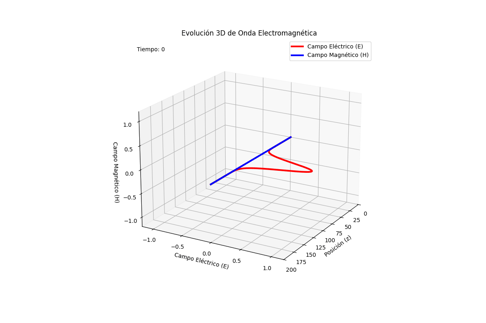
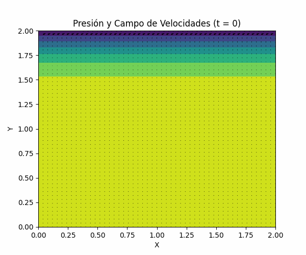

# Differential-Equations-Numerical-Solvers

# Numerical Solvers for Differential Equations (Finite Difference Method)

This repository provides a collection of numerical solvers for partial differential equations (PDEs) and ordinary differential equations (ODEs), implemented in **C++** with a modular, object-oriented approach. 

The project focuses on solving fundamental physical equations categorized by their mathematical nature: **Parabolic, Elliptic, and Hyperbolic**.

## Theoretical Foundation: Finite Difference Method (FDM)

The core numerical technique used across these solvers is the **Finite Difference Method**. By discretizing the continuous domain into a computational grid, partial derivatives are approximated using Taylor series expansions.

### 1. Elliptic Equations (Poisson & Laplace)
Used for steady-state problems such as electrostatic potentials or steady temperature distributions.

**Equation form:**
$$\nabla^2 u = f(\mathbf{r}) \implies \frac{\partial^2 u}{\partial x^2} + \frac{\partial^2 u}{\partial y^2} = \rho(x, y)$$

**Discretization (Five-Point Stencil):**
Approximating the Laplacian on a 2D grid:
$$u_{i,j} \approx \frac{1}{4} [u_{i+1,j} + u_{i-1,j} + u_{i,j+1} + u_{i,j-1}] - \pi \rho(i\Delta, j\Delta)\Delta^2$$

---

### 2. Parabolic Equations (Heat Equation)
Describes the evolution of a system over time, such as thermal conduction.

**Equation form:**
$$\frac{\partial T(\mathbf{x}, t)}{\partial t} = \alpha \nabla^2 T(\mathbf{x}, t)$$

**Discretization:**
Using a forward difference in time and central difference in space (FTCS):
$$T_{i,j}^{n+1} = T_{i,j}^n + \eta [T_{i+1,j}^n + T_{i-1,j}^n - 2T_{i,j}^n]$$
where $\eta = \frac{\alpha \Delta t}{\Delta x^2}$.

---

### 3. Hyperbolic Equations (Maxwell & Wave Equations)
Models wave propagation and electromagnetic field dynamics.

**Maxwell's Equations (1D Case):**
For electromagnetic waves in a vacuum:
$$\frac{\partial E_x}{\partial t} = -\frac{1}{\epsilon_0} \frac{\partial H_y}{\partial z}, \quad \frac{\partial H_y}{\partial t} = -\frac{1}{\mu_0} \frac{\partial E_x}{\partial z}$$

**Discretization (Yee Algorithm / Finite Difference Time Domain):**
Fields are calculated at staggered time and space intervals ($n+1/2, k+1/2$) to ensure stability and accuracy.

---

## Implemented Physical Models
- **Maxwell Equations:** Propagation of electromagnetic fields in 1D/2D.
  
- **Navier-Stokes Equations:** Simulation of incompressible fluid flow (Poisson pressure solver).
- **Heat Equation:** Thermal diffusion in various geometries.
- **Cavity Flow:** Modeling fluid dynamics within constrained boundaries.
  

## Examples


## Project Structure
The code is organized to separate the numerical logic from the physical configuration:

```text
Differential-Equations-Numerical-Solvers/
├── src/                # .cpp source files for solvers
├── include/            # .h header files (Class definitions)
├── Python/             # Scripts for data visualization and plotting
├── docs/               # Technical notes and derivations
└── README.md
```


